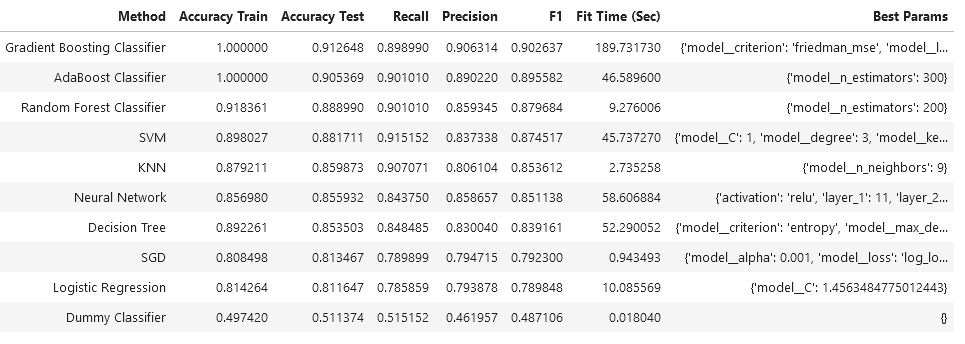
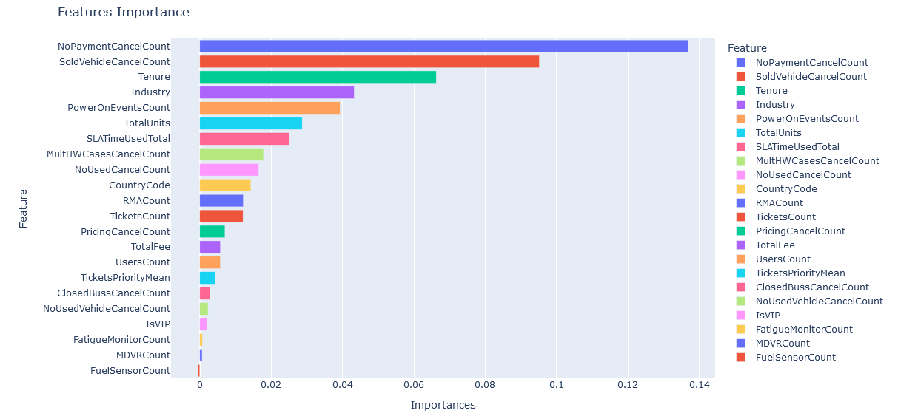

# Capstone Company-Churn

### Business Understanding ###

A company that offers GPS services understands that its business is focused on providing accurate and reliable tracking and tracing solutions. It needs to recognize the importance of safety, operational efficiency and convenience for its customers, covering various sectors such as transportation, logistics, agriculture, health and sports.

Customers are the main means of subsistence and the reason for the company's existence, therefore it is necessary to respond to the following:

#### Research Question ####

How can I predict whether or not a customer will cancel the service offered in the company where I work (I work in a geolocation services company)?

#### Why this question is important? ####

Predicting customer cancellations is crucial for a geolocation services company as it enables proactive retention strategies, reducing churn and associated costs. It allows for targeted resource allocation and service improvements, enhancing customer satisfaction and loyalty. Accurate predictions aid in better revenue forecasting and financial planning, mitigating risks. Moreover, it provides a competitive edge through personalized customer engagement and data-driven strategic decisions, fostering continuous improvement and innovation.

### Data ###

The data I am using is obtained directly from the CRM application that the company has, among that data we have information on complaints and claims, RMA and support cases of each customer.

The data can be found in this link

[FullChurn.csv](https://github.com/camorante/Company-Churn-Final/blob/main/data/FullChurn.csv)

### Notebook Link ###

The following notebook contains all the development of the analysis carried out.

[Capstone.ipynb](https://github.com/camorante/Company-Churn-Final/blob/main/Capstone.ipynb)

### The techniques and Analysis ###

1 Collect client data from the current date up to two years ago. Filter the characteristics through correlation diagrams.

2 Perform a cleaning of the information in order to eliminate redundant data and outliers. 

3 Train classification model as baseline to have a point of comparison.

4 Train KNN, Logistic regression, Decision Tree, SGDClassifier, SVM, Neural Network(for testing and comparison purposes only) and Ensemble models in search of the best one. Oversampling ADASYN techniques will be used.

5 Once the model has been found, debugged and improved a version 1.0 will be deployed in production for use by the customer service area.

### Data Understanding ###

1 **ID**: Unique identification code of the company.   
2 **IsVIP**: Indicates if the customer is a VIP.   
3 **CountryCode**: Customer's Country Code   
4 **TotalUnits**: Number of GPS units purchased by the customer.   
5 **TotalFee**: Total charge for the service provided in USD dollars.   
6 **Industry**: Industry to which the customer belongs   
7 **Tenure**: customer's tenure in months   
8 **UsersCount**: count of users that the customer has on the platform   
9 **Churn**: Target variable, 1: Churn, 0: Not Churn   
10 **ChurnPerc**: Percentage of units in Churn   
11 **TicketsCount**: Count of support cases to date   
12 **TicketsPriorityMean**: Average priority of support cases(1: low, 2: normal, 3: high)   
13 **TicketsClosedCount**: count of closed support cases   
14 **SLATimeUsedTotal**: Total SLA Time Used which is the result of the sum of the SLA time of each case (each case has a maximum time of attention)   
15 **SLATimeUsedMean**: Average SLA time for all customer's cases   
16 **SLAPercentageTotal**: Total percentage which is a result of the sum of the SLA percentage spent on each case (a case that exceeds 100% of SLA is that it exceeded the maximum total time previously set for that case)   
17 **SLAPercentageMean**: Average percentage of SLA use   
18 **NonCompliantSLACount**: Count of cases that did not comply with the SLA   
19 **RMACount**: Count of cases returned to manufacturer for each customer in case of warranty   
20 **RMAUnitsCount**: Count of units returned to the manufacturer for each customer   
21 **MDVRCount**: Count of MDVR cameras owned by customer   
22 **FatigueMonitorCount**: Count of fatigue/drowsiness sensors owned by customer    
23 **FuelSensorCount**: Count of fuel sensors owned by the customer    
24 **PowerOnEventsCount**: Count of power on/off events of the GPS units owned by the customer   
25 **PricingCancelCount**: Count of requests for cancellation of customer's units for reasons of too high price of the service.   
26 **ClosedBussCancelCount**: Count of cancellation requests from the customer for reasons of business closure or bankruptcy.   
27 **NoPaymentCancelCount**: Count of customer's unit cancellation requests due to non-payment of invoices.   
28 **SoldVehicleCancelCount**: Count of requests for cancellation of customer's units due to sale of vehicles   
29 **NoUsedVehicleCancelCount**: Count of customer's unit cancellation requests due to unused vehicles   
30 **MultHWCasesCancelCount**: Count of customer's unit cancellation requests due to hardware problems in units   
31 **NoUsedCancelCount**: Count of customer's unit cancellation requests due to units not being used by customer   

### Data Preparation and Cleaning ###

Industry and Countrycode have nulls which we will impute in order to fill these null values.

#### Correlations and Imbalance: ####

The dataset has some imbalance but it is possible to correct it later with oversampling.

Some features(SLAPercentageMean, TicketsClosedCount, SLAPercentageTotal, SLATimeUsedMean, RMAUnitsCount, NonCompliantSLACount ) with a correlation = 1 were removed

ChurnPerc is removed as it is a target value as well, it would only be used in case of regression and not classification.

#### Duplicates: ####

There is very little duplicate data (1.89%) so there is no need to remove it.

### Models ###

For the training I used 9 different models in order to find the most optimal one (A dummy classifier will be used as a baseline reference model):

* Logistic Regression
* KNN
* Decision Tree
* SVM
* SGDClassifier
* Random Forest Classifier (ensemble)
* AdaBoost Classifier (ensemble)
* Gradient Boost Classifier (ensemble)
* Neural Network

I am also using oversampling(adasyn or smote) and GridSearchCV as cross validation.

### Model Evaluation ###

As we can see AdaBoost Classifier and Gradient Boosting Classifier are the best scoring models among the others, but they have a big problem, they are in overfitting which I dismissed them as good predictors to use in the production environment. Random Forest Classifier is a clear candidate to be released in production as it is fast to train and has a good score, SVM has a good F1 score but is discarded as it has too long training times.

The use of neural networks is discarded since these networks need a larger amount of data to perform well than what we have available at the moment and were modeled only for the purpose of testing and comparison.

### Feature Importances

As a main feature we have that the NoPaymentCancelCount feature has a lot of weight when predicting churn followed by tenure, this is probably due to the fact that non-payment of services by customers is a very powerful incentive to terminate a service contract by both parties.

The ternure is another case in which the oldest customers are the most likely to leave because they are the most mature when it comes to deciding whether the service offered is really what they need.

SoldVehicleCancelCount is a feature to be taken into account because when customers sell their vehicles the service of those GPS units is impossible to recover since the service becomes practically useless.

### Data Exploratory and Features Analysis

#### Churn Count By Industry

The tenure feature is very interesting because as we can see in the graph, the average tenure is higher in customers with churn, that gives us an idea that the customer is more likely to cancel more and more services the longer he has used them. It is necessary to implement a stronger strategy that takes care of the old customers without neglecting the new ones.

#### Churn By Tenure (Mean)

The tenure feature is very interesting because as we can see in the graph, the average tenure is higher in customers with churn, that gives us an idea that the customer is more likely to cancel more and more services the longer he has used them. It is necessary to implement a stronger strategy that takes care of the old customers without neglecting the new ones.

#### Churn Mean By No Payment

The count of service cancellations due to stop paying for the service is notoriously much higher in customers with churn, which is natural, the recommendation is that if a customer stops paying for the service and the reason is because the service does not seem adequate, try to retain him and convert him to continue and pay the value owed.

#### Churn Count By Country

This value indicates that Colombia is the country that has more churn than others, this value is somewhat biased because the USA is no longer a target country for sales but still has loyal customers, the reason is that the USA is under another brand. The real comparison is between Colombia and Peru, and as you can see the churn is very high in Colombia compared to Peru.

#### Churn Count By RMA Units

The number of RMAs is much higher (twice as high) for customers without churn than for customers with churn, which gives us an idea that RMA is a valid strategy to retain customers because they feel well taken care of when product warranties are enforced.

#### Churn Count By Pricing

Cancellations due to cost and service prices are quite high when the client is in churn, here it is advisable to implement a commercial strategy that allows some prices to be more affordable for those who are willing to pay them. Perhaps the cost-benefit perception is lower than expected.

### Findings ###

* The best performing model was Random Forest as it was fast to train and had a fairly acceptable score for production environments.
* Neural networks are not the most suitable to use in this case, since they are more complex to train and require a large amount of data for training.
* Tenure is an important feature, the older a customer is the more likely to cancel service.
* RMA(return to manufacturer) and warranty policy is very important as it is an acceptable strategy to retain customers.
* Caution should be taken with customers who have overdue balances as it is quite likely that they will cancel the contract, it is necessary to implement measures to improve the payment plan of these customers.
* Price is a feature to be taken into account as customers tend to cancel contracts when the price is higher than necessary.

### Next Steps ###

* It is necessary to continue improving the dataset with fresh and quality information as it arrives, as it is a process that must continue over time to improve the models.
* Conduct customer satisfaction surveys to capture their perception of the service and use this data to improve the model.

### References ###
 
1. Neural networks
	- [Automatic Neural Network Hyperparameter Tuning for TensorFlow](https://www.youtube.com/watch?v=6Nf1x7qThR8&list=PL_dIG47tFc1dECePR7yyvAGv7pM0iqlDX&index=32)
	- [Introduction to the Keras Tuner](https://www.tensorflow.org/tutorials/keras/keras_tuner)
	
2. Oversampling
	- [SMOTE and Other Options: A Comprehensive Guide to Handling Imbalanced Data](https://towardsdatascience.com/use-smote-with-caution-3fa015ba3bc5)
	- [Oversampling — Handling Imbalanced Data](https://medium.com/@abdallahashraf90x/oversampling-for-better-machine-learning-with-imbalanced-data-68f9b5ac2696)
	
3. Hyperparameter Tuning
	- [Hyper-parameter tuning with Pipelines](https://medium.com/@kocur4d/hyper-parameter-tuning-with-pipelines-5310aff069d6)
	
4. Classification Models
	- [The Kernel Trick in Support Vector Classification](https://towardsdatascience.com/the-kernel-trick-c98cdbcaeb3f)
	- [Cost-Complexity Pruning](http://mlwiki.org/index.php/Cost-Complexity_Pruning)
	- [Complete Guide to Understanding Precision and Recall Curves](https://analyticsindiamag.com/developers-corner/complete-guide-to-understanding-precision-and-recall-curves/)